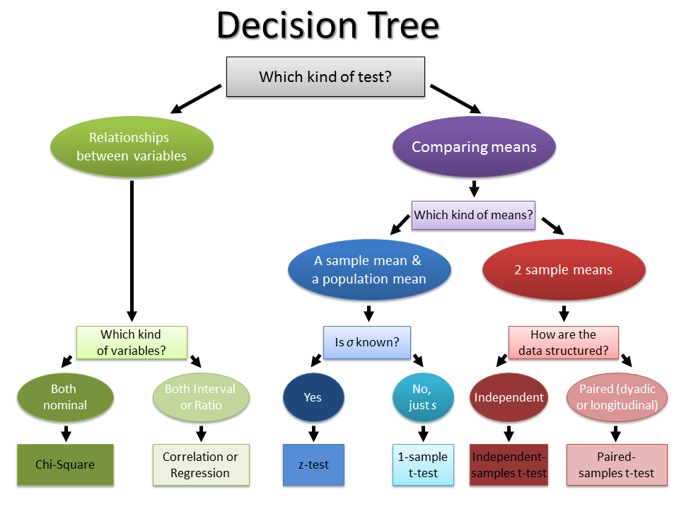

**Statistical tests** are crucial tool in modern data analysis. Using interactive data exploration tools is now easy for user to evaluate a large number of *hypotesis*. Non-expert users however can be trapped by the so-called jesuello 
[@effect]

# Statistical Hypotesis Testing Tree (SH2T)

In the following image we can see that

|  |

# Glossary

# Bibliography

# Backlog

List of definitions

* P-hacking
* multiple comparison problem
* Targeted exploration
* Freefrom exploration
* Uniform Exploration
* List of statistical tests
* Is it useful to let the userknow about MCP?

